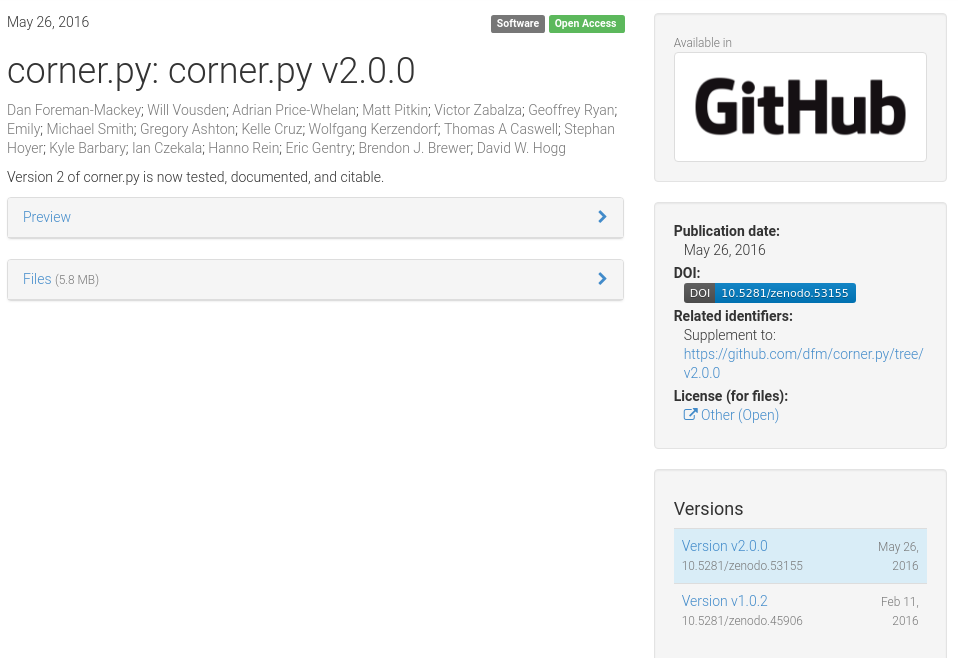

# Asclepias Project

## Use cases

### Zenodo - Record citations
{: #zenodo-citations}

Zenodo records at the moment can display metadata and relationships to other
objects only via user-submitted metadata. Displaying links from aggregators and
other sources, would enhance the experience of both the owner of the record and
users that are interested in its academic significance in a scientific field.
The challenging part is actually gathering and parsing these relationships form
all these providers, who serve them under different APIs and formats.



These challenges can be mitigated by accessing the consolidated and normalized
relationships that are gathered and stored in a link Broker service. The
various relationships that involve the Zenodo record's identifier (ie. its DOI)
can be exposed via the Broker's REST API and be fetched and rendered on a
record's page in the form of citations and other types of links.


In the above use-case the software package `corner.py` is used as an example.
Although citations for the specific version of the software package (i.e.
`v2.0.0`) are useful, what is also possible and needed is the ability to get a
rolled-up view of citations for all of the versions of the software (e.g.
`v1.0.2`), and even generic citations to the software. This is made possible
by specifying as part of the REST API query the grouping which should be used
for the package to be at the "version" level.

### Software Broker Service - New citations notifications
{: #ads-notifications}

> TODO: Expand on the current workflow involving ADS harvesting Zenodo's
> OAI-PMH endpoint for software records.


## Data Model

At the heart of the Broker service's data model are two entities:
**Identifiers** and **Relationships**. Identifiers represent references to
scholarly entities and follow a specific identifier scheme (e.g. `DOI`,
`arXiv`, `URL`, etc). Relationships have a specific type and exist between two
identifiers, the source and the target (e.g. `isIdenticalTo`, `hasVersion`,
`cites`, `isSupplementOf`, etc.).

To represent scholarly entities (i.e. software, articles, etc.), the concept of
**Groups** is introduced. Groups define a set Identifiers which are formed
based on the Relationships between them. For example, one can define that all
Identifiers that have Relationships of type `isIdenticalTo` form a Group of
type `Identity` and can be considered as a single entity.

One can then finally model Relationships between scholarly entities (e.g.
*Paper A cites Software X*), by abstracting the low-level Relationships between
Identifiers to the Group level and thus form **Group Relationships**. For
example, one can define that `Identity` Groups of Identifiers that have
Relationships of type `cites` to Identifiers of other `Identity` Groups, form a
`cites` Group Relationship.

Based on the aforementioned descriptions, in the illustration below we can see
a representation of the following entities:

- **Identifiers**: A1, A2, A3, B1, B2, C1, C2
- **Relationships**
  - A2 cites B1
  - C2 cites B2
- **Groups**
  - A, identified by A1, A2, A3
  - B, identified by B1, B2
  - C, identified by C1, C2
- **Group relationships**
  - Group A cites Group B
  - Group C cites Group B


### Metadata

Identifiers, Relationships and Groups can form complex graphs. While this is
important for discovering connections between them, it is also valuable to be
able to retrieve information about the objects they hold references to. In
order to facilitate this information, **Group Metadata** and **Group
Relationship Metadata** is stored for **Groups** and **Group Relationships**
respectively.

An example use-case of this metadata is for the rendering of a proper citation
when needed (as done in [Zenodo record pages](#zenodo-citations)).

### Events

Raw information is "packaged" inside **Events**. Events arrive to the broker
service and are stored and ingested in order to be broken down to their base
entities: Identifiers, Relationships and Metadata. These entities are then
processed and integrated into the existing data to enhance the knowledge that
the broker service possesses.

## Ingestion workflows


The Broker service is populating its links store through a variety of different
methods. Some of these are accepting data that is pushed from trusted external
sources while others actively harvest the links from publicly available link
aggregators.

The common denominator between these methods is the format of the link data
which is based on [Scholix v3](http://scholix.org/). Any data input that
arrives to the Broker is either pre-processed to comply or already complies
with the Scolix schema. This allows for a robust ingestion pipeline which can
keep track of the underlying scholarly objects, their identifiers and the
relationships between them.

Link data is "packaged" inside **Events** and stroed in its original form for
reference.

## Interoperability

On a higher level, Broker services aim at achieving interoperability with other
brokers or services which at this point were not able to formally communicate
with each other and exchange information. The goal is to build a Broker Network
where each participant focuses on maintaining the information that he has the
best domain knowledge on and ability to extract the most quiality information
from. This way the quality of the information is kept high and concentraded in
separate parts of the network, avoiding redundant information that is unused,
but at the same time allowing inidividual participants to decide about what
kind of information they want to store depending on their needs. In its
entirety, the network can then hold vast amounts of high quality knowledge
in a distributed manner.

For example, ADS has a specialized ingestion workflow for extracting various
forms of citations and references to software packages related to astrophysics.
For that reason it would make more sense for ADS to push this knowledge to a
Software Broker Service and not e.g. a Humanities & Social Scienses broker.


## Interfaces

The Broker Service exposes two public interfaces:

- A queryable REST API, which allows interested clients to pull information via
  ad-hoc queries
- A push notification service, based on common Publisher-Subscriber patterns,
  which relays ingested link events to subscribers

## REST API

### Controlled vocabularies

- **RelationType**: `cites`, `isCitedBy`, `isSupplementTo`, `isSupplementedBy`, `isRelatedTo`
- **ObjectType**: `literature`, `dataset`, `software`, `unknown`
- **GroupType**: `identity`, `version`

### `GET /relationships`

#### Parameters

| Name     | Description                                                                      | Type                        | Example                         |
| -------- | -------------------------------------------------------------------------------- | --------------------------- | ------------------------------- |
| id       | Value of source identifer                                                        | string, required            | `10.5281/zenodo.1120265`        |
| scheme   | Identifier scheme of the source identifier                                       | string                      | `doi`, `arxiv`, `url`           |
| relation | Filter by type of the relation between source and target identifiers             | string, oneOf(RelationType) | `isCitedBy`, `isSupplementedBy` |
| type     | Filter by type of target objects                                                 | string, oneOf(ObjectType)   | `literature`, `software`        |
| from     | Filter by start date of publication/discovery of the relationships               | ISO-8601 datetime           | `2018-01-02T13:30:00`           |
| to       | Filter by end date of publication/discovery of the relationships                 | ISO-8601 datetime           | `2018-01-12`                    |
| groupBy  | Expand the scope of the relationships to source identifier (default: `identity`) | string, oneOf(GroupType)    | `identity`, `version`           |

#### HTTP headers

##### `Accept` for content negotiation

*Default: `application/x-scholix-v3+json`*

| Content-Type                              | Description     |
| ----------------------------------------- | --------------- |
| `application/x-scholix-v3+json`           | Scholix v3 JSON |
| `application/vnd.citationstyles.csl+json` | CSL JSON        |

#### Response

> NOTE: JSONSchema available in the
> [asclepias/asclepias-broker](https://github.com/asclepias/asclepias-broker/blob/master/asclepias_broker/jsonschemas/relationships.json)
> GitHub repository. All JSONSchemas should be made publicly available at
> [https://asclepias.github.io](https://asclepias.github.io)

#### Examples

The following request would return all objects that are citing the DOI
10.5281/zenodo.53155, or an identical identifier to it (e.g. the URL
[https://zenodo.org/record/53155](https://zenodo.org/record/53155)).

`GET /relationships?id=10.5281/zenodo.53155&scheme=doi&relation=isCitedBy`

```json
{
    "Source": {
        "Title": "corner.py v2.0.0",
        "Identifiers": [
            {"ID": "10.5281/zenodo.53155", "IDScheme": "doi"},
            {"ID": "https://zenodo.org/record/53155", "IDScheme": "url"},
            {"ID": "https://github.com/dfm/corner.py/tree/v2.0.0", "IDScheme": "url"},
            {"ID": "https://github.com/dfm/triangle.py/tree/v2.0.0", "IDScheme": "url"}
        ],
        "Creator": [{"Name": "Dan Foreman-Mackey"}, {"Name": "Will Vousden"}],
        "Type": {"Name": "software"},
        "PublicationDate": "2016-05-26"
    },
    "Relation": {"Name": "isCitedBy"},
    "GroupBy": "identity",
    "Relationships": [
        {
            "Target": {
                "Title": "The mass distribution and gravitational potential of the Milky Way",
                "Type": {"Name": "literature"},
                "Identifiers": [
                    {"ID": "10.1093/mnras/stw2759", "IDScheme": "doi"},
                    {"ID": "https://doi.org/10.1093/mnras/stw2759", "IDScheme": "url"},
                    {"ID": "https://academic.oup.com/mnras/article/465/1/76/2417479", "IDScheme": "url"},
                ],
                "Creator": [{"Name": "Paul J. McMillan"}],
                "PublicationDate": "2016-10-26"
            },
            "LinkHistory": [
                {"LinkPublicationDate": "2016-12-01", "LinkProvider": {"Name": "Zenodo"}},
                {"LinkPublicationDate": "2016-10-28", "LinkProvider": {"Name": "ADS"}}
            ]
        },
        {
            "Target": {
                "Title": "PROBABILISTIC FORECASTING OF THE MASSES AND RADII OF OTHER WORLDS",
                "Identifiers": [
                    {"ID": "10.3847/1538-4357/834/1/17", "IDScheme": "doi"},
                    {"ID": "http://iopscience.iop.org/article/10.3847/1538-4357/834/1/17", "IDScheme": "url"},
                    {"ID": "https://doi.org/10.3847/1538-4357/834/1/17", "IDScheme": "url"},
                ],
                "Creator": [{"Name": "Jingjing Chen"}, {"Name": "David Kipping"}],
                "PublicationDate": "2016-12-27"
            },
            "LinkHistory": [
                {"LinkPublicationDate": "2016-12-30", "LinkProvider": {"Name": "ADS"}}
            ]
        }
    ]
}
```

The following request would return all objects that are citing the DOI
10.5281/zenodo.53155, an identical identifier to it (e.g. the URL
[https://zenodo.org/record/53155](https://zenodo.org/record/53155)), or a
different version of this object (e.g. [corner.py
v1.0.2](https://zenodo.org/record/45906)):

`GET /relationships?id=10.5281/zenodo.53155&scheme=doi&relation=isCitedBy&groupBy=version`

```javascript
// Similar paylod as before, though with
{ ... }
```

## Notifications

*Note: The Notifications component of the Broker service is still under
development. High level aspects will not change, though implementation details
might.*

The notifications component implements a basic Publisher-Subscriber pattern,
which allows for other services to subscribe to a stream of **Events** that the
broker receives, ingests and then pushes to subscribers.

### Subscriptions

Subscribers can create multiple customizable subscriptions which allow
matching specific events by a variety of criteria over their attributes. For
example, a subscriber might be only interested in Εvents that involve objects
of the "software" type.

Another important aspect of this process is the ability of a subscriber to
request a re-transmission of the Εvents that the Broker would deliver to him
over a specific period of time. For example, this allows subscribers to be
brought up to date with potentially "missed" events after a period of
unavailability.
